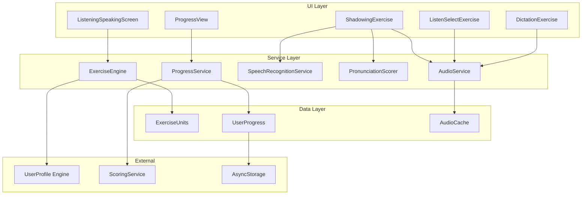

# Design Document: Listening & Speaking Training Module

## Overview

听说训练模块是 DuoXX 应用的核心功能模块，提供 AI 跟读评分、听音辨句、听写练习等功能，帮助用户提升语音感知和口语输出能力。

本模块采用分层架构设计，将语音识别、发音评分、音频播放等核心能力抽象为独立服务，通过练习引擎统一调度。模块复用现有的评分系统（IRT + CEFR）和进度追踪机制，确保与其他学习模块的一致性。

### 核心功能

1. **影子跟读 (Shadowing)** - 播放标准音频，用户跟读，AI 评分
2. **听音辨句 (Listen & Select)** - 播放音频，选择正确的文本选项
3. **听写练习 (Dictation)** - 播放音频，用户输入听到的内容
4. **自适应学习** - 基于 IRT 的能力评估和难度调整

### 技术选型

- **语音识别**: Expo Speech Recognition API（本地优先，支持离线）
- **音频播放**: Expo AV（已在项目中使用）
- **发音评分**: 基于文本相似度 + 音频特征分析
- **状态管理**: React Hooks + AsyncStorage
- **测试框架**: Jest + fast-check（属性测试）

## Architecture



## Components and Interfaces

### 1. Exercise Types

```typescript
/**
 * 听说练习类型
 */
export type ListeningSpeakingExerciseType =
  | 'shadowing'        // 影子跟读
  | 'listen-select'    // 听音辨句
  | 'dictation'        // 听写练习
  | 'repeat-after';    // 跟读复述

/**
 * 基础练习接口
 */
export interface LSExercise {
  id: string;
  type: ListeningSpeakingExerciseType;
  audioUrl: string;
  audioText: string;           // 音频对应的文本
  audioTranslation?: string;   // 中文翻译
  difficulty: number;          // IRT 难度参数 (-3 to 3)
  cefrLevel: CEFRLevel;
  xpReward: number;
  tags?: string[];
}

/**
 * 影子跟读练习
 */
export interface ShadowingExercise extends LSExercise {
  type: 'shadowing';
  displayText: boolean;        // 是否显示文本
  allowSlowPlayback: boolean;  // 是否允许慢速播放
}

/**
 * 听音辨句练习
 */
export interface ListenSelectExercise extends LSExercise {
  type: 'listen-select';
  options: ListenSelectOption[];
  correctOptionId: string;
  maxReplays: number;          // 最大重播次数
}

/**
 * 听写练习
 */
export interface DictationExercise extends LSExercise {
  type: 'dictation';
  hints?: string[];            // 提示词
  acceptableVariants?: string[]; // 可接受的变体答案
}
```

### 2. Pronunciation Scoring

```typescript
/**
 * 发音评分结果
 */
export interface PronunciationScore {
  overallScore: number;        // 总分 0-100
  accuracyScore: number;       // 准确度 0-100
  fluencyScore: number;        // 流利度 0-100
  completenessScore: number;   // 完整度 0-100
  wordScores: WordScore[];     // 单词级评分
  timestamp: string;
  audioReference?: string;     // 音频引用
}

/**
 * 单词级评分
 */
export interface WordScore {
  word: string;
  expectedWord: string;
  score: number;               // 0-100
  status: 'correct' | 'mispronounced' | 'missing' | 'extra';
  startTime?: number;          // 音频中的起始时间
  endTime?: number;            // 音频中的结束时间
}

/**
 * 发音评分器接口
 */
export interface IPronunciationScorer {
  /**
   * 评估发音
   */
  evaluate(
    recognizedText: string,
    expectedText: string,
    audioFeatures?: AudioFeatures
  ): PronunciationScore;

  /**
   * 序列化评分结果
   */
  serialize(score: PronunciationScore): string;

  /**
   * 反序列化评分结果
   */
  deserialize(json: string): PronunciationScore | null;
}
```

### 3. Audio Service

```typescript
/**
 * 播放速度选项
 */
export type PlaybackSpeed = 0.5 | 0.75 | 1.0 | 1.25;

/**
 * 音频播放状态
 */
export interface AudioPlaybackState {
  isPlaying: boolean;
  isLoaded: boolean;
  position: number;            // 当前位置（毫秒）
  duration: number;            // 总时长（毫秒）
  speed: PlaybackSpeed;
  error?: string;
}

/**
 * 音频服务接口
 */
export interface IAudioService {
  load(url: string): Promise<void>;
  play(): Promise<void>;
  pause(): Promise<void>;
  stop(): Promise<void>;
  seek(position: number): Promise<void>;
  setSpeed(speed: PlaybackSpeed): Promise<void>;
  getState(): AudioPlaybackState;
  onPlaybackComplete(callback: () => void): void;
  onError(callback: (error: string) => void): void;
  unload(): Promise<void>;
}
```

### 4. Speech Recognition Service

```typescript
/**
 * 语音识别结果
 */
export interface SpeechRecognitionResult {
  text: string;
  confidence: number;          // 0-1
  isFinal: boolean;
  alternatives?: string[];
}

/**
 * 语音识别服务接口
 */
export interface ISpeechRecognitionService {
  isAvailable(): Promise<boolean>;
  requestPermission(): Promise<boolean>;
  startRecording(): Promise<void>;
  stopRecording(): Promise<SpeechRecognitionResult>;
  cancelRecording(): void;
  onPartialResult(callback: (result: SpeechRecognitionResult) => void): void;
  onError(callback: (error: string) => void): void;
}
```

### 5. Exercise Engine

```typescript
/**
 * 练习会话状态
 */
export interface ExerciseSessionState {
  currentExerciseIndex: number;
  exercises: LSExercise[];
  results: ExerciseResult[];
  startTime: string;
  isComplete: boolean;
}

/**
 * 练习结果
 */
export interface LSExerciseResult {
  exerciseId: string;
  exerciseType: ListeningSpeakingExerciseType;
  isCorrect: boolean;
  score: number;               // 0-100
  pronunciationScore?: PronunciationScore;
  userInput?: string;
  responseTimeMs: number;
  timestamp: string;
}

/**
 * 练习引擎接口
 */
export interface IExerciseEngine {
  /**
   * 开始新会话
   */
  startSession(unitId: string): Promise<ExerciseSessionState>;

  /**
   * 获取当前练习
   */
  getCurrentExercise(): LSExercise | null;

  /**
   * 提交答案
   */
  submitAnswer(answer: ExerciseAnswer): Promise<LSExerciseResult>;

  /**
   * 进入下一题
   */
  nextExercise(): LSExercise | null;

  /**
   * 结束会话
   */
  endSession(): SessionSummary;

  /**
   * 获取会话状态
   */
  getSessionState(): ExerciseSessionState;
}
```

### 6. Progress Service

```typescript
/**
 * 听说能力进度
 */
export interface ListeningSpeakingProgress {
  userId: string;
  listeningAbility: DimensionAbility;
  speakingAbility: DimensionAbility;
  completedUnits: string[];
  totalExercises: number;
  correctExercises: number;
  totalPracticeTimeMs: number;
  streakDays: number;
  lastPracticeDate: string;
  history: ProgressSnapshot[];
}

/**
 * 进度快照
 */
export interface ProgressSnapshot {
  timestamp: string;
  listeningScore: number;
  speakingScore: number;
  exercisesCompleted: number;
}

/**
 * 进度服务接口
 */
export interface IProgressService {
  getProgress(userId: string): Promise<ListeningSpeakingProgress>;
  updateProgress(result: LSExerciseResult): Promise<void>;
  markUnitComplete(unitId: string): Promise<void>;
  getProgressHistory(days: number): Promise<ProgressSnapshot[]>;
  saveProgress(): Promise<void>;
  loadProgress(): Promise<void>;
}
```

## Data Models

### Exercise Unit

```typescript
/**
 * 练习单元
 */
export interface LSUnit {
  id: string;
  name: string;
  description: string;
  theme: LSTheme;
  cefrLevel: CEFRLevel;
  icon: string;
  color: string;
  exercises: LSExercise[];
  totalXP: number;
  unlockCondition?: UnlockCondition;
  order: number;
}

/**
 * 主题分类
 */
export type LSTheme =
  | 'daily-conversation'   // 日常对话
  | 'travel'               // 旅行场景
  | 'business'             // 商务英语
  | 'pronunciation'        // 发音专项
  | 'listening-basics'     // 听力基础
  | 'news-media';          // 新闻媒体

/**
 * 解锁条件
 */
export interface UnlockCondition {
  type: 'unit-complete' | 'level-reach' | 'xp-earn';
  value: string | number;
}
```

### User State Persistence

```typescript
/**
 * 模块持久化状态
 */
export interface LSModuleState {
  version: string;
  userId: string;
  progress: ListeningSpeakingProgress;
  unitProgress: Record<string, UnitProgress>;
  settings: LSSettings;
  lastUpdated: string;
}

/**
 * 单元进度
 */
export interface UnitProgress {
  unitId: string;
  completedExerciseIds: string[];
  bestScores: Record<string, number>;
  attempts: number;
  isComplete: boolean;
}

/**
 * 模块设置
 */
export interface LSSettings {
  defaultPlaybackSpeed: PlaybackSpeed;
  autoPlayNext: boolean;
  showTranslation: boolean;
  enableHapticFeedback: boolean;
}
```


## Correctness Properties

*A property is a characteristic or behavior that should hold true across all valid executions of a system-essentially, a formal statement about what the system should do. Properties serve as the bridge between human-readable specifications and machine-verifiable correctness guarantees.*

Based on the acceptance criteria analysis, the following correctness properties have been identified for property-based testing:

### Property 1: Pronunciation scoring produces valid scores

*For any* recognized text and expected text pair, the Pronunciation_Scorer SHALL return a PronunciationScore where:
- overallScore is in range [0, 100]
- accuracyScore is in range [0, 100]
- fluencyScore is in range [0, 100]
- completenessScore is in range [0, 100]
- wordScores array contains entries for all words in the expected text

**Validates: Requirements 1.4**

### Property 2: Answer validation returns correct result

*For any* ListenSelectExercise with options and a correctOptionId, when a user selects an option:
- If selectedOptionId equals correctOptionId, isCorrect SHALL be true
- If selectedOptionId does not equal correctOptionId, isCorrect SHALL be false

**Validates: Requirements 2.3**

### Property 3: Replay count respects maximum limit

*For any* exercise with maxReplays setting, the number of replays allowed SHALL NOT exceed maxReplays value. After maxReplays is reached, further replay requests SHALL be rejected.

**Validates: Requirements 2.5**

### Property 4: Dictation comparison produces consistent word-level results

*For any* user input text and target text, the comparison algorithm SHALL:
- Identify all words that match exactly as 'correct'
- Identify all words in target but not in input as 'missing'
- Identify all words in input but not in target as 'extra'
- The union of correct, missing, and extra words SHALL cover all unique words from both texts

**Validates: Requirements 3.3**

### Property 5: Exercise selection matches user ability range

*For any* user ability level θ and configured difficulty range δ, all selected exercises SHALL have difficulty d where: θ - δ ≤ d ≤ θ + δ

**Validates: Requirements 4.2**

### Property 6: IRT-based ability update follows formula

*For any* exercise result with item difficulty b and user response (correct/incorrect), the ability update SHALL follow the IRT model where:
- Correct answers on harder items (b > θ) increase ability more than correct answers on easier items
- Incorrect answers on easier items (b < θ) decrease ability more than incorrect answers on harder items

**Validates: Requirements 4.3**

### Property 7: Session statistics are correctly calculated

*For any* completed session with n exercises and k correct answers:
- accuracyRate SHALL equal k / n
- exercisesCompleted SHALL equal n
- totalXP SHALL equal sum of xpReward for all exercises where isCorrect is true

**Validates: Requirements 5.2**

### Property 8: Progress round-trip through storage

*For any* valid ListeningSpeakingProgress object, serializing to storage and then deserializing SHALL produce an object equivalent to the original, with all numeric values, arrays, and nested objects preserved.

**Validates: Requirements 5.4, 5.5**

### Property 9: Playback speed accepts valid values only

*For any* PlaybackSpeed value in {0.5, 0.75, 1.0, 1.25}, setSpeed SHALL succeed. *For any* value not in this set, setSpeed SHALL reject the value or clamp to nearest valid value.

**Validates: Requirements 6.2**

### Property 10: Pause/resume maintains position

*For any* audio playback at position p, calling pause() then play() SHALL resume playback from position p (within acceptable tolerance of ±100ms).

**Validates: Requirements 6.3**

### Property 11: Seek updates position correctly

*For any* valid position p where 0 ≤ p ≤ duration, seek(p) SHALL update the current position to p. *For any* position p < 0, seek SHALL clamp to 0. *For any* position p > duration, seek SHALL clamp to duration.

**Validates: Requirements 6.4**

### Property 12: Score-to-color mapping is consistent

*For any* score value:
- score ≥ 80 SHALL map to 'green' (good)
- 60 ≤ score < 80 SHALL map to 'yellow' (acceptable)
- score < 60 SHALL map to 'red' (needs improvement)

**Validates: Requirements 7.1**

### Property 13: Pronunciation score serialization round-trip

*For any* valid PronunciationScore object:
- serialize() SHALL produce a valid JSON string containing timestamp, audioReference, overallScore, accuracyScore, fluencyScore, completenessScore, and wordScores
- deserialize(serialize(score)) SHALL produce an object equivalent to the original score

**Validates: Requirements 8.1, 8.2, 8.3, 8.5**

### Property 14: Invalid JSON deserialization returns error

*For any* string that is not valid JSON or does not conform to PronunciationScore schema, deserialize() SHALL return null without throwing an exception.

**Validates: Requirements 8.4**

### Property 15: Unit completion marks unit complete

*For any* unit with n exercises, when all n exercises have been completed (regardless of correctness), the unit SHALL be marked as isComplete = true and bonus XP SHALL be awarded.

**Validates: Requirements 9.3**

### Property 16: Unlock condition triggers unlock

*For any* locked unit with unlock condition C and user state S:
- If S satisfies C, the unit SHALL be unlocked
- If S does not satisfy C, the unit SHALL remain locked

**Validates: Requirements 9.5**

### Property 17: Error handling does not throw

*For any* error condition in the module (audio load failure, speech recognition error, storage error), the error handler SHALL catch the error and return a structured error result without throwing an unhandled exception.

**Validates: Requirements 10.4**

## Error Handling

### Audio Service Errors

```typescript
export enum AudioErrorType {
  LOAD_FAILED = 'LOAD_FAILED',
  PLAYBACK_FAILED = 'PLAYBACK_FAILED',
  NETWORK_ERROR = 'NETWORK_ERROR',
  UNSUPPORTED_FORMAT = 'UNSUPPORTED_FORMAT',
}

export interface AudioError {
  type: AudioErrorType;
  message: string;
  retryable: boolean;
  originalError?: Error;
}
```

### Speech Recognition Errors

```typescript
export enum SpeechErrorType {
  NOT_AVAILABLE = 'NOT_AVAILABLE',
  PERMISSION_DENIED = 'PERMISSION_DENIED',
  RECOGNITION_FAILED = 'RECOGNITION_FAILED',
  TIMEOUT = 'TIMEOUT',
  NETWORK_ERROR = 'NETWORK_ERROR',
}

export interface SpeechError {
  type: SpeechErrorType;
  message: string;
  fallbackAvailable: boolean;
}
```

### Error Recovery Strategy

1. **Audio Load Failure**: Show error message, offer retry button, suggest checking network
2. **Speech Recognition Unavailable**: Disable shadowing exercises, suggest dictation as alternative
3. **Storage Error**: Retry with exponential backoff, fall back to in-memory state
4. **Network Error**: Enable offline mode with cached content

## Testing Strategy

### Dual Testing Approach

This module uses both unit tests and property-based tests for comprehensive coverage:

- **Unit tests**: Verify specific examples, edge cases, and integration points
- **Property-based tests**: Verify universal properties that should hold across all inputs

### Property-Based Testing Framework

- **Library**: fast-check (already used in the project)
- **Minimum iterations**: 100 runs per property
- **Test file location**: Co-located with source files using `.test.ts` suffix

### Property Test Implementation Guidelines

Each property-based test MUST:
1. Be tagged with a comment referencing the correctness property: `**Feature: listening-speaking, Property {number}: {property_text}**`
2. Use smart generators that constrain to valid input space
3. Run minimum 100 iterations
4. Avoid mocking where possible to test real behavior

### Test Categories

#### 1. Pronunciation Scorer Tests
- Property 1: Valid score ranges
- Property 13: Serialization round-trip
- Property 14: Invalid JSON handling

#### 2. Exercise Engine Tests
- Property 2: Answer validation
- Property 3: Replay limit
- Property 4: Dictation comparison
- Property 5: Exercise selection by ability
- Property 6: IRT ability update

#### 3. Progress Service Tests
- Property 7: Session statistics
- Property 8: Progress persistence round-trip
- Property 15: Unit completion
- Property 16: Unlock conditions

#### 4. Audio Service Tests
- Property 9: Playback speed validation
- Property 10: Pause/resume position
- Property 11: Seek position

#### 5. UI Utility Tests
- Property 12: Score-to-color mapping

#### 6. Error Handling Tests
- Property 17: Error handling safety

### Generator Examples

```typescript
// PronunciationScore generator
const pronunciationScoreArb = fc.record({
  overallScore: fc.integer({ min: 0, max: 100 }),
  accuracyScore: fc.integer({ min: 0, max: 100 }),
  fluencyScore: fc.integer({ min: 0, max: 100 }),
  completenessScore: fc.integer({ min: 0, max: 100 }),
  wordScores: fc.array(wordScoreArb, { minLength: 1, maxLength: 20 }),
  timestamp: fc.date().map(d => d.toISOString()),
  audioReference: fc.option(fc.string()),
});

// Exercise generator with valid difficulty range
const exerciseArb = (userAbility: number, range: number) =>
  fc.record({
    id: fc.uuid(),
    difficulty: fc.double({ min: userAbility - range, max: userAbility + range }),
    // ... other fields
  });
```

### Unit Test Examples

```typescript
describe('PronunciationScorer', () => {
  it('should return zero scores for empty input', () => {
    const result = scorer.evaluate('', 'hello world');
    expect(result.overallScore).toBe(0);
    expect(result.completenessScore).toBe(0);
  });

  it('should return perfect scores for exact match', () => {
    const result = scorer.evaluate('hello world', 'hello world');
    expect(result.overallScore).toBe(100);
    expect(result.accuracyScore).toBe(100);
  });
});
```
